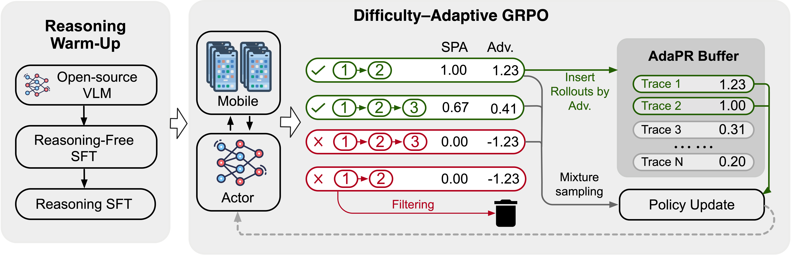

# MobileRL: Online Agentic Reinforcement Learning for Mobile GUI Agents

> **TL;DR.** We introduce MobileRL, an online agentic reinforcement learning framework that turns general-purpose vision-language models into strong mobile GUI agents. By combining a staged reasoning warm-up with difficulty-adaptive online RL, MobileRL achieves state-of-the-art success rates on AndroidWorld and AndroidLab, substantially outperforming both proprietary and open-source baselines. The MobileRL is also deployed in the AutoGLM production pipeline.

## Open-Source Roadmap
Will be open-sourced soon upon legal approval: 
- [ ] **Evaluation framework** 
- [ ] **MobileRL-9B checkpoint** 

## Abstract

Building general-purpose graphical user interface (GUI) agents has become increasingly promising with the progress in vision language models. However, developing effective mobile GUI agents with reinforcement learning (RL) remains challenging due to the heavy-tailed distribution of task difficulty and the inefficiency of large-scale environment sampling. We present an online agentic reinforcement learning framework MobileRL to enhance GUI agents in mobile environments. Its core component is the Difficulty-Adaptive GRPO (AdaGRPO) algorithm. In AdaGRPO, we design difficulty-adaptive positive replay and failure curriculum filtering to adapt the model to different task difficulties. We introduce the shortest path reward adjustment strategy to reshape rewards concerning the task length in multi-turn agentic tasks. Those strategies jointly stabilize RL training, improve sample efficiency, and generate strong performance across diverse mobile apps and tasks. We apply MobileRL to two open models (Qwen2.5-VL-7B-Instruct and GLM-4.1V-9B-Base). The resultant MobileRL-9B model achieves state-of-the-art results in terms of success rates on both AndroidWorld (75.8%) and AndroidLab (46.8%). The MobileRL framework is adopted in the AutoGLM products.

## Method Overview

Mobile GUI agents must follow complex instructions, reason over cluttered screens, and act under sparse, delayed rewards—all while task difficulty is heavy-tailed and environment sampling is expensive.  
**MobileRL** addresses these challenges with a two-stage recipe:

1. **Reasoning Warm-up:**  
   - **reasoning-free sft** on large expert data.  
   - **reasoning sft** to inject and polish rationale-driven planning and transparency.

2. **Online Agentic RL (Difficulty–Adaptive GRPO, AdaGRPO):**  
   - **Adaptive Positive Replay (AdaPR):** store high-quality trajectories and re-use them efficiently.  
   - **Failure Curriculum Filtering (FCF):** prune low-quality rollouts and focus learning on actionable tasks.  
   - **Shortest-Path Reward Adjustment (SPA):** reward shaping that stabilizes credit assignment for long-horizon interactions.

---

## 📊 Main Results

We evaluate on two interactive Android benchmarks:

- **AndroidWorld** (rule-based trajectory rewards)
- **AndroidLab** (LM-based reward model; see paper appendix for details)

**Success Rate (SR, %) — higher is better**

| Models (Proprietary & Open)       | #Params | AndroidWorld | AndroidLab |
| --------------------------------- | ------: | -----------: | ---------: |
| GPT-4o-2024-11-20                 |       – |         34.5 |       31.2 |
| Claude-Sonnet-4-20250514-thinking |       – |         41.0 |       40.6 |
| Qwen2.5-VL-7B-Instruct            |      7B |         27.6 |       10.1 |
| GLM-4.1V-9B-Thinking              |      9B |         41.7 |       24.6 |
| UI-Tars-7B                        |      7B |         33.0 |       32.6 |
| V-Droid                           |      8B |         59.5 |       38.3 |
| UI-Tars-1.5                       |      -  |         64.2 |          - |
| UI-Genie-Agent                    |     72B |            – |       41.2 |

**Our method (MobileRL)**

| MobileRL Variant                 | #Params | AndroidWorld | AndroidLab |
| -------------------------------- | ------: | -----------: | ---------: |
| **MobileRL w/ Qwen2.5-VL-7B**    |      7B |     **72.0** |   **42.5** |
| **MobileRL w/ GLM-4.1V-9B-Base** |      9B |     **75.8** |   **46.8** |

---

## Ablations & What Matters

MobileRL’s performance comes from both stages:

- Framework ablation (Qwen2.5-VL-7B backbone):  
  1) +reasoning-free sft → 50.2 / 36.9 SR  
  2) +reasoning sft → 56.8 / 38.7 SR  
  3) +Online RL (AdaGRPO) → 72.0 / 42.5 SR  
     _(AndroidWorld / AndroidLab)_

- Component ablations (examples from paper):  
  - w/o AdaGRPO (online RL): drops to 56.8 SR on AndroidWorld.  
  - Removing AdaPR, SPA, or FCF each harms SR, highlighting the importance of adaptive replay, reward adjustment, and failure-focused curricula.